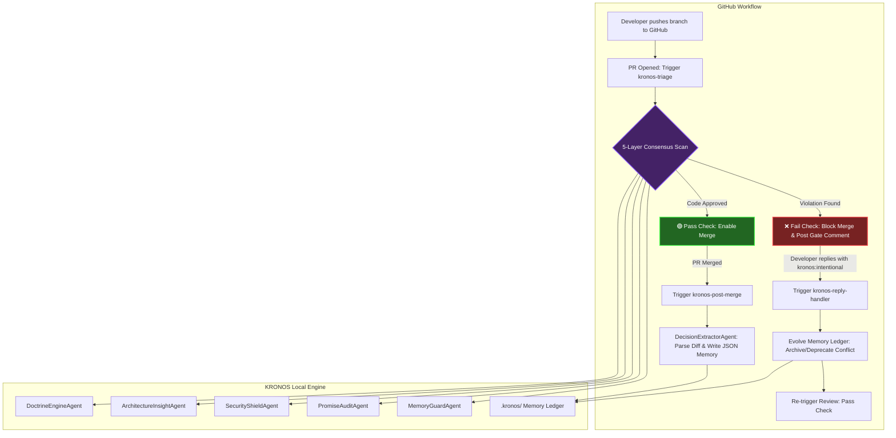

# 🧠 KRONOS: Institutional Memory Gate for GitHub

[]()
[]()
[]()

> "Teams rarely repeat failures because they are careless. They repeat failures because architectural memory disappears, reviewer knowledge gets buried, and institutional context leaves with engineers. KRONOS blocks merges not out of distrust, but because your predecessors already paid the price."

---

## 📽️ System Architecture

KRONOS operates as a closed-loop DevOps guardrail. It monitors Pull Requests actively, executes a 5-layer consensus security and architectural compliance review, blocks regressions at the merge gate, extracts new architectural memories post-merge, and evolves its knowledge ledger based on interactive developer comment threads.



---

## 🛡️ The 5-Layer Consensus Micro-Architecture

Every Pull Request undergoes parallel evaluation across five highly specialized AI agents coordinated by the central `MRReviewAgent` (Review Coordinator):

| Layer | Agent | Goal | Technique |
| :--- | :--- | :--- | :--- |
| **Layer 1** | **Memory Guard** | Prevent Architectural Regression | Correlates proposed code changes against the active historical rules saved in the `.kronos/` ledger. |
| **Layer 2** | **Promise Audit** | Detect Scope & PR Promise Mismatch | Compares the PR title and description (promises) against the raw code changes to detect hidden/undocumented side effects. |
| **Layer 3** | **Security Shield** | Prevent Application Vulnerabilities | Paranoid AppSec sentinel checking for SQLi, JWT symmetric key leakage, raw credential logging, and unsafe evaluations. |
| **Layer 4** | **Architecture Insight** | Stop Tech Drift | Tracks new dependency patterns and architectural divergence from the corporate module blueprint (e.g. `FixedIntervalRetry`). |
| **Layer 5** | **Doctrine Engine** | Enforce Conventions | Scans for structural code hygiene, missing types, and strict coding conventions. |

---

## 🧬 Phase 3: Closed-Loop Memory Evolution

KRONOS does not have a static database; it uses **Git-native, self-healing memory**.

### 1. Post-Merge Decision Extraction (`kronos extract-pr`)
Once a PR is merged, the `DecisionExtractorAgent` automatically analyzes the code changes, extracts the core architectural decisions made, assigns an incremental ID (e.g., `KRONOS-MEMORY-008`), and saves it back into the repository as a structured JSON memory ledger in the `.kronos/` directory.

### 2. Interactive Evolution Reply Hook (`kronos handle-reply`)
If a PR is blocked by KRONOS but the change was deliberate (e.g. upgrading database infrastructure to handle high concurrent load), an architect can override the gate by replying directly on the PR comment:

```text
kronos:intentional we upgraded our backend infrastructure to handle high concurrent load.
```

The `ReplyHandlerAgent` captures this command via a GitHub comment webhook, automatically moves the conflicting rule's status to `Deprecated`, commits the evolved memory ledger back to the repository, and triggers a check re-run—which immediately unlocks the merge gate!

---

## 📊 Cyberpunk Telemetry Dashboard

KRONOS includes a premium, glassmorphic dark-mode web console designed to visualize architectural drift and project health:

*   **Interactive Decision Mesh**: A complete visual flowchart displaying memories, governed file paths, and current status (Active vs. Deprecated).
*   **Memory Vault**: A searchable ledger detailing governed files, authors, date decided, historical context, and decided-by handles.
*   **Sustainability & Carbon Telemetry**: Tracks estimated computational load and carbon offset savings resulting from enforcing optimized connection pooling and fixed retries.

---

## 💻 CLI Commands Guide

The KRONOS CLI is packaged as a standard Python module. Install it locally in development mode:

```bash
pip install -e ./kronos-cli
```

### 1. Validate Memory Ledger
Checks all JSON files inside `.kronos/` to ensure strict schema validation against the Pydantic models.
```bash
kronos validate --path .kronos
```

### 2. Generate Cyberpunk Dashboard
Generates a stunning glassmorphic visual report of your architectural governance ledger.
```bash
kronos dashboard --path .kronos --output dashboard.html
```

### 3. Actively Review Pull Request (GitOps Gateway)
Runs the 5-layer multi-agent consensus review on a specific GitHub Pull Request. Setting `--fail-on-conflict` enables strict guardrails, returning exit code 1 to block merging on failure.
```bash
kronos review-pr --repo owner/repo --pr PR_NUMBER --fail-on-conflict
```

### 4. Post-Merge Extraction
Hook triggered after a successful merge to extract code changes and save them back into the `.kronos/` ledger.
```bash
kronos extract-pr --repo owner/repo --pr PR_NUMBER --path .kronos
```

### 5. Process Developer Overrides
Webhook utility to process interactive inline commands (e.g. `kronos:intentional`) and evolve the memory ledger.
```bash
kronos handle-reply --repo owner/repo --pr PR_NUMBER --comment "COMMENT_BODY" --path .kronos
```

---

## ⚙️ GitHub Actions CI/CD Integration

To integrate KRONOS as an automated architectural gateway in your repository, place the following workflow in `.github/workflows/kronos.yml`:

```yaml
name: KRONOS Institutional Memory Gate

on:
  pull_request:
    types: [opened, synchronize, reopened, closed]
  issue_comment:
    types: [created]

permissions:
  pull-requests: write
  issues: write
  contents: write

jobs:
  kronos-triage:
    runs-on: ubuntu-latest
    if: github.event_name == 'pull_request' && github.event.action != 'closed'
    steps:
      - name: Checkout Code
        uses: actions/checkout@v4
        with:
          fetch-depth: 0
      - name: Setup Python
        uses: actions/setup-python@v4
        with:
          python-version: '3.10'
      - name: Install KRONOS Core
        run: pip install ./kronos-cli
      - name: Active Consensus Review
        env:
          GITHUB_TOKEN: ${{ secrets.GITHUB_TOKEN }}
          ANTHROPIC_API_KEY: ${{ secrets.ANTHROPIC_API_KEY }}
          PR_NUMBER: ${{ github.event.pull_request.number }}
          REPO: ${{ github.repository }}
        run: kronos review-pr --repo $REPO --pr $PR_NUMBER --fail-on-conflict
```

---

## 🚀 Rebranded Corporate Workspace (`atlas/`)

Under the hood, KRONOS protects your core microservice architecture structured inside the production-grade **`atlas/`** modular namespace:

*   🔒 **`atlas/security/auth/`**: Governs credentials validation and authentication retries.
*   🛢️ **`atlas/database/infrastructure/`**: Enforces secure SSL socket connections and robust pool allocation.
*   💳 **`atlas/core/payments/`**: Enforces strict PCI-DSS gateway tokenization protocols.
*   📊 **`atlas/core/telemetry/`**: Redacts raw logs and masks Personally Identifiable Information (PII).

---

> "I block this merge not because I distrust you. I block it because your predecessors already paid the price for this pattern."
> — **KRONOS**